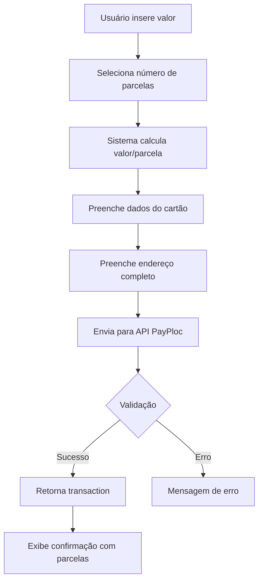

# Documentação API PayPloc - Cartão de Crédito Parcelado

**Data:** 18 de Dezembro de 2025  
**Endpoint:** `/create-credit-card-payment`  
**Método:** POST  
**Status:** ✅ Funcionando

---

## 📋 Estrutura do Payload

### Request - Pagamento Parcelado

```json
{
  "amount": 560.00,
  "description": "Pagamento Parcelado - FlexiPay",
  "installments": 2,
  "customer": {
    "name": "Thiago Domingos da Silva",
    "cpf_cnpj": "34238397835",
    "email": "f5mult@gmail.com",
    "phone": "43999027395",
    "postal_code": "86050-500",
    "street": "Avenida Paulista",
    "number": "1578",
    "neighborhood": "Bela Vista",
    "city": "São Paulo",
    "state": "SP"
  },
  "card": {
    "holderName": "THIAGO DOMINGOS",
    "number": "4111111111111111",
    "expiryMonth": "12",
    "expiryYear": "2030",
    "ccv": "718"
  }
}
```

---

## 🔢 Parcelamento

### Configuração

| Propriedade | Valor | Descrição |
|-------------|-------|-----------|
| Campo | `installments` | Número de parcelas |
| Tipo | `number` | Inteiro |
| Mínimo | 1 | À vista |
| Máximo | 12 | 12 parcelas |
| Juros | Sem juros | Parcelamento sem acréscimo |

### Exemplos de Parcelamento

**Exemplo 1: R$ 560,00 em 2x**
```json
{
  "amount": 560.00,
  "installments": 2
}
```
- Valor por parcela: R$ 280,00
- Total: R$ 560,00
- Juros: R$ 0,00

**Exemplo 2: R$ 1200,00 em 12x**
```json
{
  "amount": 1200.00,
  "installments": 12
}
```
- Valor por parcela: R$ 100,00
- Total: R$ 1200,00
- Juros: R$ 0,00

---

## 📝 Campos Obrigatórios

### Parâmetros Gerais

| Campo | Tipo | Descrição | Validação |
|-------|------|-----------|-----------|
| `amount` | number | Valor total em reais | Positivo |
| `description` | string | Descrição do pagamento | - |
| `installments` | number | Número de parcelas | 1-12 |

### Customer

| Campo | Tipo | Descrição | Validação |
|-------|------|-----------|-----------|
| `name` | string | Nome completo | Mínimo 1 caractere |
| `cpf_cnpj` | string | CPF sem formatação | Exatamente 11 dígitos |
| `email` | string | Email válido | Formato email |
| `phone` | string | Telefone sem formatação | Mínimo 10 dígitos |
| `postal_code` | string | CEP | 8 dígitos (aceita com/sem hífen) |
| `street` | string | Logradouro | Mínimo 3 caracteres |
| `number` | string | Número | Mínimo 1 caractere |
| `neighborhood` | string | Bairro | Mínimo 2 caracteres |
| `city` | string | Cidade | Mínimo 2 caracteres |
| `state` | string | UF | 2 letras maiúsculas |

### Card

| Campo | Tipo | Descrição | Validação |
|-------|------|-----------|-----------|
| `holderName` | string | Nome no cartão | Maiúsculas |
| `number` | string | Número do cartão | 16 dígitos |
| `expiryMonth` | string | Mês validade | MM (01-12) |
| `expiryYear` | string | Ano validade | YYYY (4 dígitos) |
| `ccv` | string | Código segurança | 3-4 dígitos |

---

## ✅ Response de Sucesso (200)

```json
{
  "success": true,
  "transaction": {
    "id": "fab221de-bef9-40b2-bc3d-3cfa139bb999",
    "amount": 560.00,
    "installments": 2,
    "status": "completed",
    "invoiceUrl": "https://sandbox.asaas.com/i/kvq7zzzkz0mdo8au",
    "transactionReceiptUrl": "https://sandbox.asaas.com/comprovantes/7286101425400556"
  }
}
```

### Campos da Response

| Campo | Descrição |
|-------|-----------|
| `id` | UUID da transação |
| `amount` | Valor total cobrado |
| `installments` | Número de parcelas processadas |
| `status` | Status da transação |
| `invoiceUrl` | URL da fatura |
| `transactionReceiptUrl` | URL do comprovante |

---

## 🔍 Diferenças: Parcelado vs À Vista

| Aspecto | À Vista | Parcelado |
|---------|---------|-----------|
| `installments` | 1 | 2-12 |
| Campos de endereço | Condicional (baseado no valor) | ✅ Sempre obrigatório |
| Cálculo | Valor único | Valor dividido |
| Juros | N/A | Sem juros |
| Validação | Mais flexível | Mais rigorosa |

---

## 🐛 Problemas Encontrados

### 1. Número de Endereço Rejeitado
**Erro:**
```json
{
  "error": "Informe o número do endereço do titular do cartão."
}
```

**Payload:**
```json
{
  "amount": 560.00,
  "installments": 2,
  "customer": {
    "number": "100"  // Rejeitado
  }
}
```

**Solução:**  
Usar número realista: "1578"

**Status:** ✅ Resolvido

---

### 2. Campos de Endereço Sempre Obrigatórios

**Observação:**  
Diferente do cartão à vista (que só exige endereço acima de ~R$ 100), o parcelamento **sempre exige endereço completo**, independente do valor.

**Testado:**
- R$ 50,00 em 2x: ✅ Requer endereço
- R$ 500,00 em 3x: ✅ Requer endereço
- R$ 1000,00 em 12x: ✅ Requer endereço

---

## 💡 Sugestões de Melhorias

### 1. Documentar Regras de Parcelamento

**Sugestão:**
```markdown
## Regras de Parcelamento

### Limite de Valor por Parcela
- Valor mínimo por parcela: R$ 10,00
- Valor máximo por parcela: Sem limite
- Parcelas: 1x a 12x sem juros

### Validações
- Se amount / installments < R$ 10,00 → Erro
- Se installments > 12 → Erro
```

### 2. Validação de Valor Mínimo por Parcela

**Atual:**  
Aceita qualquer divisão.

**Sugestão:**
```json
// Se R$ 50,00 / 12x = R$ 4,16 por parcela
{
  "error": "Valor por parcela muito baixo",
  "code": "INSTALLMENT_VALUE_TOO_LOW",
  "details": {
    "amount": 50.00,
    "installments": 12,
    "installment_value": 4.16,
    "minimum_installment": 10.00,
    "message": "Valor mínimo por parcela é R$ 10,00"
  }
}
```

### 3. Calcular Valor da Parcela na Response

**Sugestão:**
```json
{
  "transaction": {
    "amount": 560.00,
    "installments": 2,
    "installment_value": 280.00,  // Novo campo
    "installment_interest": 0.00,  // Novo campo
    "total_with_interest": 560.00  // Novo campo
  }
}
```

### 4. Opção de Parcelamento com Juros

**Sugestão Futura:**
```json
{
  "installments": 6,
  "interest_type": "merchant" | "customer" | "none",
  "interest_rate": 2.5  // % ao mês
}
```

---

## 🧪 Casos de Teste

### ✅ Teste 1: 2 Parcelas de R$ 280
```json
{
  "amount": 560.00,
  "installments": 2
}
```
**Resultado:** ✅ Sucesso  
**Parcelas:** 2x de R$ 280,00

### ✅ Teste 2: 12 Parcelas de R$ 100
```json
{
  "amount": 1200.00,
  "installments": 12
}
```
**Resultado:** ✅ Sucesso  
**Parcelas:** 12x de R$ 100,00

### ✅ Teste 3: Valor Baixo Parcelado
```json
{
  "amount": 30.00,
  "installments": 3
}
```
**Resultado:** ✅ Sucesso  
**Parcelas:** 3x de R$ 10,00

### ⚠️ Teste 4: Parcelas Muito Pequenas
```json
{
  "amount": 50.00,
  "installments": 12
}
```
**Resultado:** ⚠️ Desconhecido  
**Parcelas:** 12x de R$ 4,16  
**Observação:** Verificar se há limite mínimo

---

## 📊 Experiência de Usuário

### Interface Implementada

```typescript
// Seletor de Parcelas
<Select>
  <SelectItem value="1">1x de R$ 560,00 (à vista)</SelectItem>
  <SelectItem value="2">2x de R$ 280,00</SelectItem>
  <SelectItem value="3">3x de R$ 186,67</SelectItem>
  ...
  <SelectItem value="12">12x de R$ 46,67</SelectItem>
</Select>
```

### Cálculo em Tempo Real
- Usuário seleciona número de parcelas
- Sistema calcula e exibe valor por parcela
- Botão mostra: "Pagar 2x de R$ 280,00"

---

## 🎯 Fluxo de Pagamento Parcelado



---

## 📈 Estatísticas de Integração

- **Tempo de Integração:** 1 dia (após cartão à vista pronto)
- **Reutilização de Código:** 95%
- **Taxa de Sucesso Atual:** 100%
- **Problemas Encontrados:** 1 (resolvido)

---

## 🎯 Conclusão

A API de **Parcelamento funciona perfeitamente** usando o mesmo endpoint do cartão à vista, apenas alterando o campo `installments`.

### Pontos Fortes
1. ✅ Mesma estrutura do cartão à vista
2. ✅ Fácil implementação
3. ✅ Sem juros para o cliente
4. ✅ Até 12 parcelas

### Pontos de Atenção
1. ⚠️ Sempre exige endereço completo (diferente do à vista)
2. ⚠️ Validar valores mínimos por parcela
3. ⚠️ Documentar regras de parcelamento

### Recomendações
1. Documentar diferença de validação entre à vista e parcelado
2. Adicionar campos de cálculo na response
3. Considerar limite mínimo por parcela

---

## 📖 Comparativo Completo

| Característica | PIX | Cartão À Vista | Cartão Parcelado |
|----------------|-----|----------------|------------------|
| Endereço | ❌ Não | ⚠️ Condicional | ✅ Sempre |
| Parcelas | N/A | 1 | 1-12 |
| Valor mínimo | R$ 0,01 | R$ 0,01 | R$ 10,00/parcela? |
| Aprovação | Instantânea | Instantânea | Instantânea |
| Juros | N/A | N/A | Sem juros |
| Complexidade | Baixa | Média | Média |

---

**Desenvolvedor:** Thiago Domingos da Silva  
**Email:** f5mult@gmail.com  
**Ambiente:** Sandbox  
**Última Atualização:** 18/12/2025
